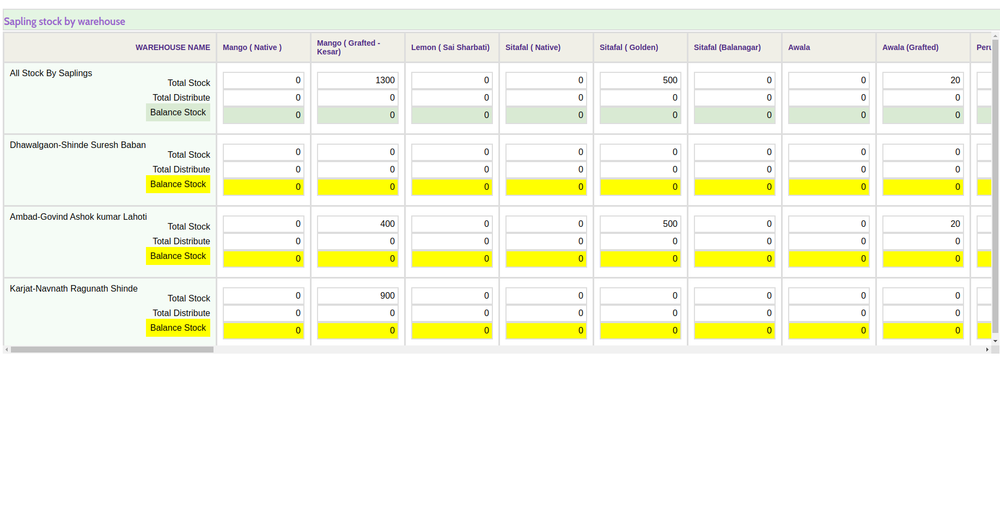

# Sapling Stock Management Application

This application provides an interface for managing and displaying sapling stock data by warehouse. It fetches sapling master data and sapling stock data from JSON files and presents the data in a tabular format.

## Table of Contents

1.Installation
2.Project Structure
3.Features
4.Main code explanation
5.Usage
6.Styling
7.Snapshot
8.Conclusion

## Install dependencies:

    npm install

Run the application:

    npm run dev

## Project Structure

    sapling-stock-management/
    ├── public/
    │   ├── saplings_master.json
    │   ├── saplinginwardoutward.json
    │   └── index.html
    ├── src/
    │   ├── App.css
    │   ├── App.js
    │   └── index.js
    ├── .gitignore
    ├── package.json
    └── README.md

## Features

Data Fetching: Fetches saplings master data and sapling stock data from JSON files.
Data Processing: Aggregates sapling stock data by saplings and warehouses.
Data Display: Displays data in a table format with fixed headers and first column for better readability.

## Main Code Explanation
**App Component:**
The App component is the main component of the application, which does the following:

**State Initialization:**

saplingsMaster: Stores the master list of saplings.
saplingStockData: Stores the stock data for saplings.
allStockBySaplings: Stores the aggregated data of sapling stock by sapling codes.

**Fetching Data:**

The data is fetched from two JSON files (saplings_master.json and saplinginwardoutward.json) located in the public directory.
The fetched data is stored in the respective state variables.

**Data Processing:**

The allStockBySaplingsData object is initialized to store the aggregated stock data by sapling codes.
The stock data is iterated over to calculate the total inward, outward, and balance stock for each sapling code.

**Grouping Data by Warehouse:**

The stock data is grouped by warehouse for easier display in the table.

**Rendering:**

The data is rendered in a table format. The table has sticky headers and a sticky first column for better readability.
The table displays the total stock, total distribute, and balance stock for each sapling and warehouse.

## Usage

**Fetching Data:**    

The application fetches sapling master data from saplings_master.json.
It also fetches sapling stock data from saplinginwardoutward.json.

**Data Processing:**

Sapling stock data is aggregated to calculate total stock, total distribute, and balance stock for each sapling.
The data is further grouped by warehouse for detailed display.

**Data Display:**   

The main interface is a table with saplings as columns and warehouses as rows.
Each cell displays the total stock, total distribute, and balance stock for the respective sapling and warehouse.

## Styling

The application uses custom CSS for styling, located in App.css.
Fonts are imported from Google Fonts.
Table headers and first column are sticky for better navigation.
Different colors and styles are applied to distinguish between total stock, distribute, and balance stock.

## Snapshot

## Conclusion

This application provides a comprehensive view of sapling stock data, allowing users to easily manage and analyze sapling stocks across different warehouses. The use of React ensures a dynamic and responsive user interface, while the custom styling enhances readability and user experience.
